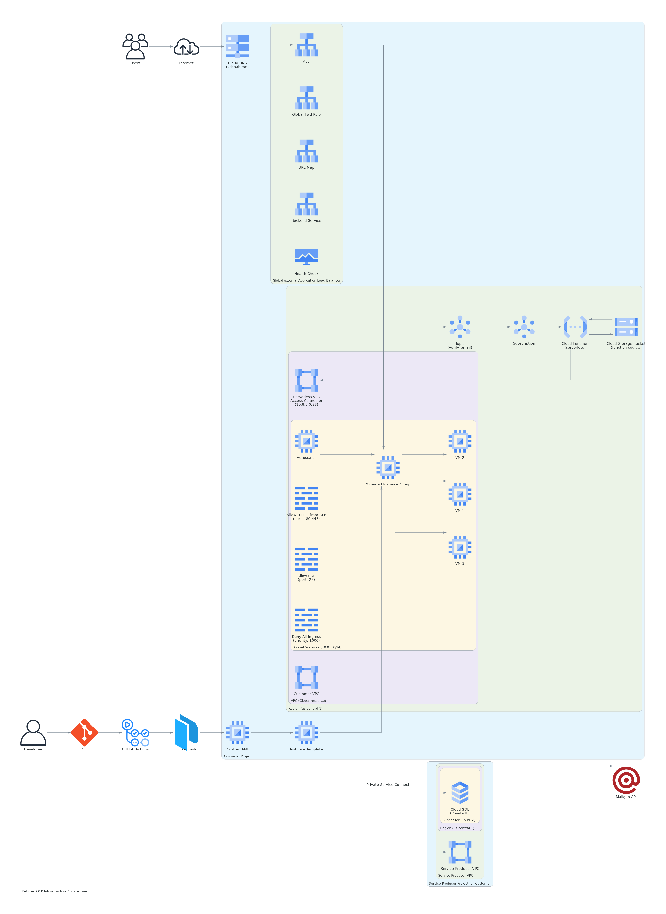

# Cloud Application - Core Backend

This repository contains the core backend code used to create golden images for cloud deployment. It serves as the API foundation for the cloud application.

## Project Description

This is the backend service for a cloud-native application that:
- Manages user accounts with secure authentication
- Provides RESTful API endpoints
- Integrates with Google Cloud services
- Designed for deployment as immutable infrastructure

## Key Features

- User management (create, read, update)
- Email verification system
- Health check monitoring
- Secure password storage
- Comprehensive logging
- Infrastructure as Code (IaC) support

## Technology Stack

### Backend
- Node.js
- Express
- Sequelize (MySQL)
- Winston (logging)
- Google Cloud Pub/Sub

### Infrastructure
- Packer for golden image creation
- Google Compute Engine
- Systemd service management
- Cloud Operations monitoring

## System Architecture



## Development Setup

1. Clone the repository
2. Install dependencies: `npm install`
3. Configure environment variables (see `.env.example`)
4. Run in development: `npm run dev`

## Deployment

The application is designed to be deployed as a Packer-built golden image with:

```bash
packer build main.pkr.hcl
```

## API Documentation

Endpoints:
- `POST /v4/user` - Create user account
- `GET /v4/user/self` - Get user details
- `PUT /v4/user/self` - Update user details
- `GET /healthz` - Health check
